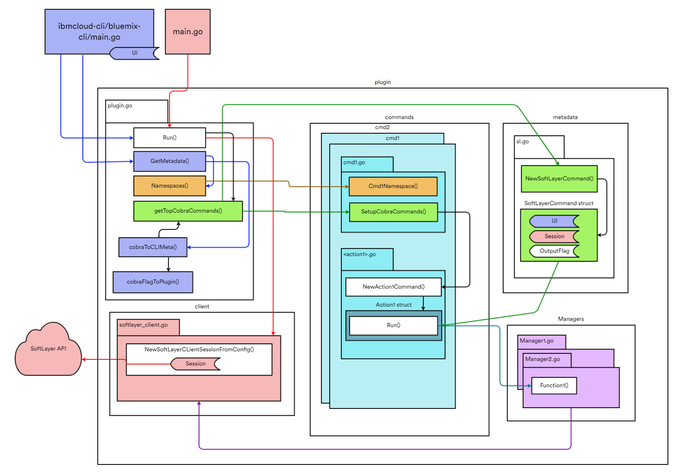
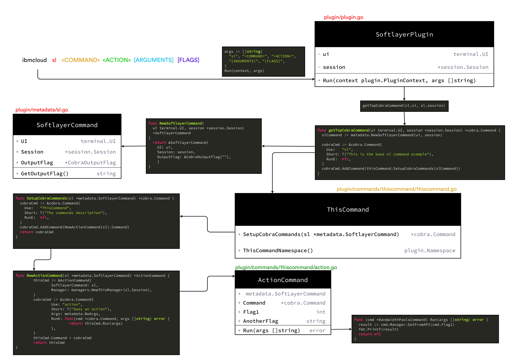

[](https://travis.ibm.com/SoftLayer/softlayer-cli)


# softlayer-cli

This repository houses the code that powers the [ibmcloud-cli sl](https://github.ibm.com/Bluemix/bluemix-cli) command. Altough this project is packaged as a plugin, it is built directly into the ibmcloud-cli.


# Project Setup

Your golang source directory should be setup as follows

```
~/go/src/github.ibm.com/ibmcloud-cli/bluemix-cli
~/go/src/github.ibm.com/SoftLayer/softlayer-cli
```

github.ibm.com/ibmcloud-cli/bluemix-cli should be branched off from the `dev` branch
github.ibm.com/SoftLayer/softlayer-cli should be branched off from the `master` branch

Edit github.ibm.com/Bluemix/bluemix-cli/go.mod and add this line to the `replace` section. This will force `go mod vendor` to read changes from your local directory instead of off github.ibm.com. You may also need to change `github.ibm.com/SoftLayer/softlayer-cli v0.0.1` to `github.ibm.com/SoftLayer/softlayer-cli latest` in the require section.

```
github.ibm.com/SoftLayer/softlayer-cli => ../../SoftLayer/softlayer-cli
```

From there, make any changes you need to the code in `github.ibm.com/SoftLayer/softlayer-cli`. To actually see those changes apparent in `ibmcloud sl`  you will need to switch directories to `github.ibm.com/Bluemix/bluemix-cli` and run `go build`


# Testing
Before making a pull request, make sure everything looks good with these tools.
Working directory: `github.ibm.com/SoftLayer/softlayer-cli`

### What the build runs

```
go vet $(go list ./... | grep -v "fixtures" | grep -v "vendor")
go test $(go list ./... | grep -v "fixtures" | grep -v "vendor")
```

### Individual Tests

This will test all the block commands, with verbose output
```
go test -v  github.ibm.com/SoftLayer/softlayer-cli/plugin/commands/block
```

This will test only the block commands that have "Access Password" in their test name, and stop after 1 failure
```
go test -v  github.ibm.com/SoftLayer/softlayer-cli/plugin/commands/block -ginkgo.failFast  -ginkgo.focus "Access Password"
```

### Code Coverage

This will generate a code coverage report for all the file commands

```
$> go test -coverprofile=coverage.out github.ibm.com/SoftLayer/softlayer-cli/plugin/commands/file
ok      github.ibm.com/SoftLayer/softlayer-cli/plugin/commands/file       1.225s
```

Coverage report

For basic information
```
go tool cover -func=coverage.out
```

Detailed HTML output

```
go tool cover -html=coverage.out
```

Specific Tests

```
go test -v -coverprofile=coverage.out github.ibm.com/SoftLayer/softlayer-cli/plugin/managers -ginkgo.focus Issues3190

```

### Fake Session And Handlers

To force API errors, or api results that you don't want to put in a fixture, you need to get the testhelper transport handler, something like this.

```go
    var (
        fakeSLSession  *session.Session
        fakeHandler     *testhelpers.FakeTransportHandler
        // Other fake managers/CLI things go here
    )
    BeforeEach(func() {
        fakeSLSession = testhelpers.NewFakeSoftlayerSession(nil)
        fakeHandler = testhelpers.GetSessionHandler(fakeSLSession)
        // Other fake managers/CLI things go here
    })
    AfterEach(func() {
        fakeHandler.ClearApiCallLogs()
        fakeHandler.ClearErrors()
    })
```

`fakeSLSession` will get used anytime something requres a softlayer-go session.
`fakeHandler` is responsible for "faking" the API requests. By default it does this by looking up the appropriate JSON file in `testfixtures/<SERVICE>/<METHOD>.json`. It is also possible to specify specific IDs by using this format: `testfixtures/<SERVICE>/<METHOD>-<ID>.json` which if you call `SoftLayer_Hardware/getObject(id=1234)` it will load `testfixtures/SoftLayer_Hardware/GetObject-1234.json`


#### Forcing an API Error

If you want to force an API error, do something like the following.

(From managers/hardware_tests.go)
```go
// Add the API error to the handler
fakeHandler.AddApiError("SoftLayer_Hardware_Server", "toggleManagementInterface", 500, "IPMI ERROR")
// Make the API call
err := hardwareManager.ToggleIPMI(123456, false)
// Make sure the error happened
Expect(err).To(HaveOccurred())
// Check the error message is as expected. The format will be similar to this
Expect(err.Error()).To(Equal("IPMI ERROR: IPMI ERROR (HTTP 500)"))
```

#### Checking for API calls

(from managers/hardware_test.go)

If you want to make sure an API call was properly formatted and made, do the following
```go
// Make the API call
hws, err := hardwareManager.ListHardware(...args)
// Normal Checks...
Expect(err).NotTo(HaveOccurred())
Expect(len(hws)).To(Equal(2))
// Get the apiCalls from the fakeHandler
apiCalls := fakeHandler.ApiCallLogs
// Make sure there was the right number of calls
Expect(len(apiCalls)).To(Equal(1))
// Check the service is correct 
Expect(apiCalls[0].Service).To(Equal("SoftLayer_Account"))
// get the slOptions
slOptions := apiCalls[0].Options
// Check to make sure all object filters get set properly.
Expect(slOptions.Filter).To(ContainSubstring(`"id":{"operation":"orderBy","options":[{"name":"sort","value":["DESC"]}]}`))
```
Check testhelpers/fake_softlayer_session.go for all the fields that get recorded with an API call.


### Fake Managers

CLI calls to manager functions need an entry in `bluemix-cli\bluemix\slplugin\testhelpers\fake_manager.go`


Managers have a fake/test interface that is autogenerate with a program called [couterfieter](https://github.com/maxbrunsfeld/counterfeiter)

```
# From /github.ibm.com/SoftLayer/softlayer-cli
cd plugin/managers
counterfeiter.exe -o ../testhelpers/fake_storage_manager.go . StorageManager
```

If you want to use the real manager but fixture API data, just initialize the manager like this in the CLI test

(filenames here is optional of course)
```go
BeforeEach(func() {

    filenames := []string{"getDatacenters_1",}
    fakeSLSession = testhelpers.NewFakeSoftlayerSession(filenames)
    OrderManager = managers.NewOrderManager(fakeSLSession)
    fakeUI = terminal.NewFakeUI()
    cmd = order.NewPlaceCommand(fakeUI, OrderManager, nil)
    cliCommand = cli.Command{
        Name:        metadata.OrderPlaceMetaData().Name,
        Description: metadata.OrderPlaceMetaData().Description,
        Usage:       metadata.OrderPlaceMetaData().Usage,
        Flags:       metadata.OrderPlaceMetaData().Flags,
        Action:      cmd.Run,
    }
})
```

### `[no tests to run]`
New commands needs a `command_test.go` file in the CLI directory.

If you added `slplugin/commands/new/` then there needs to be a `slplugin/commands/new/new_test.go` file. Copy the content from one of the other command test files and just change the name and package.

### Fake Transports

In unit tests, you will want to establish a FakeSoftLayerSession object so that API requests faked from test fixtures.

Something like this.
```go
BeforeEach(func() {
    fakeSLSession = testhelpers.NewFakeSoftlayerSession(nil)
    networkManager = managers.NewNetworkManager(fakeSLSession)
})
```

By default, every API call made to the SoftLayer API will load in the appropraite JSON file from `testfixtures/SoftLayer_Service/method.json`

To force errors:

```go
fakeHandler := testhelpers.FakeTransportHandler{}
fakeHandler.AddApiError("SoftLayer_Tag", "getAttachedTagsForCurrentUser", 500, "BAD")
fakeSLSession := &session.Session{TransportHandler: fakeHandler,}
```

To force a non-default JSON file to be loaded

This will load `testfixtures/SoftLayer_Network_Vlan/getObject-noBilling.json` when SoftLayer_Network_Vlan::getObject is called next.

```go
fakeSLSession = testhelpers.NewFakeSoftlayerSession([]string{"getObject-noBilling.json"})
networkManager = managers.NewNetworkManager(fakeSLSession)
```

Fixutres can also be loaded by ID automatically with the format `testfixtures/SoftLayer_Service/getObject-1234.json` where 1234 is the ID you passed into the API call.


# Development




> Terminology:
> `ibmcloud sl <COMMAND> <ACTION>`
> *COMMAND*: is a collection of actions here.
> *ACTION*: What part of the command you are running.

## Adding new commands to slplugin

1. Add an entry to `plugin/plugin.go` in the `getTopCobraCommand()` function that follows this pattern
`cobraCmd.AddCommand(newcommand.SetupCobraCommands(slCommand))`

2. Create a new folder `plugin/commands/newcommand/`
3. Create a new file `plugin/commands/newcommand/newcommand.go` Which will look like this:
```go
package newcommand

import (
    "github.com/spf13/cobra"
    "github.com/IBM-Cloud/ibm-cloud-cli-sdk/plugin"
    . "github.ibm.com/SoftLayer/softlayer-cli/plugin/i18n"
    "github.ibm.com/SoftLayer/softlayer-cli/plugin/metadata"
)

func SetupCobraCommands(sl *metadata.SoftlayerCommand) *cobra.Command {
    cobraCmd := &cobra.Command{
        Use:   "newcommand",
        Short: T("A description of the new command"),
        RunE:  nil,
    }
    cobraCmd.AddCommand(NewSomeNewCommand(sl).Command)
    return cobraCmd
}

func AccountNamespace() plugin.Namespace {
    return plugin.Namespace{
        ParentName:  "sl",
        Name:        "newcommand",
        Description: T("A description of the new command"),
    }
}
```
for tests, copy from one of the other command main test functions. Make sure to add any actions to the actions list.

## Adding new actions to slplugin

1. Create a new files `plugin/commands/the_command/action.go`
2. It should have its own type
```go
type ActionNameCommand struct {
    *metadata.SoftlayerCommand
    Command *cobra.Command
    Manager managers.SomeManager
    // Flags go here as well
}
```

3. It should have a function to create an instance of the type called `NewActionNameCommand`
```go
func NewActionNameCommand(sl *metadata.SoftlayerCommand) *ActionNameCommand {
    thisCmd := &ActionNameCommand{
        SoftlayerCommand: sl,
        Manager: managers.NewSomeManager(sl.Session),
    }
    cobraCmd := &cobra.Command{
        Use: "command-name",
        Short: T("A description of the command"),
        Long: T(`This is an optional field, you can remove it if the command is simple.
Otherwise create a nice long description of how to use this command. Its good to add some examples.

EXAMPLE:
    ${COMMAND_NAME} sl newcommand command-name --someFlag test --soomethingElse
    This sets a flag and does something else.`)
        Args: metadata.NoArgs,
        RunE: func(cmd *cobra.Command, args []string) error {
            return thisCmd.Run(args)
        },
    }
    thisCmd.Command = cobraCmd
    return thisCmd
}
```


4. It should have a `Run()` function
```go
func (cmd *BandwidthPoolsCommand) Run(args []string) error {
    // do some stuff
    return nil
}
```

5. Add the function to `command.go` in the `SetupCobraCommand` function
```go
cobraCmd.AddCommand(NewActionNameCommand(sl).Command)
```

## i18n stuff

anything with `T("some string here")` uses the internationalization system. Definitions are located in `plugin\i18n\en_US.all.json` for english.
The string passed into the `T()` function serves as the ID when looking these up. So the ID Will need to be present in all i18n files, it will also need a translation string. 

[i18n4go](https://github.com/maximilien/i18n4go) is used to make sure all strings being transalted have translations. To test run this command.
[go-i18n](https://github.com/nicksnyder/go-i18n/) is what is actually doing the translations, but its using an old v1 version.
[go-bindata](https://github.com/jteeuwen/go-bindata) takes the json files, and turns them into a go binary.

### Basic Patterns and Tips

Where possible, you should try to minimize the number of unique strings we need to translate. To do this, make use of substitutions. For example:

BAD:
```go
T("This is some output for a file command")
T("This is some output for a block command")
```

GOOD:
```go
subs := map[string]interface{}{"CMDTYPE": "block"}
T("This is some output for a {{.CMDTYPE}} command", subs)
```

### Useful Scripts

#### `./bin/catch-i18n-mismatch.sh`

If you get the following output, everything is fine
```
$ ./bin/catch-i18n-mismatch.sh  
OKTotal time: 372.753966ms
```

If you get the following output, you need to edit the translation files
```
$> ./bin/catch-i18n-mismatch.sh
>>> |"IP address {{.IP}} is not found on your account. Please confirm IP and try again.\n" exists in the code, but not in en_US| <<<
>>> |" The server ID to remove from the security group" exists in the code, but not in en_US| <<<
>>> |" The test ID to remove from the security group" exists in en_US, but not in the code| <<<
====== ADD THESE =======
[
        {"id": "IP address {{.IP}} is not found on your account. Please confirm IP and try again.\n", "translation": "IP address {{.IP}} is not found on your account. Please confirm IP and try again.\n"},
        {"id": " The server ID to remove from the security group", "translation": " The server ID to remove from the security group"}
]
====== DEL THESE =======
[
        {"id": " The test ID to remove from the security group", "translation": " The test ID to remove from the security group"}
]
```


#### `./bin/fixeverything_i18n.sh`

You can either do so manually, or run the following command which will do almost all the work for you

```
$> sh bin/fixeverything_i18n.sh
Running: ./bin/catch-i18n-mismatch.sh
Running: python ./bin/split_i18n.py
Running: ./bin/generate-i18n-resources.sh
Running: git add ./plugin/i18n/resources/*.json
Running: git add ./plugin/resources/i18n_resources.go
Running: git commit --message="Translation fixes from ./bin/fixeverything_i18n.sh"
[badBranch c12f1d7] Translation fixes from ./bin/fixeverything_i18n.sh
 11 files changed, 40 insertions(+), 20 deletions(-)
Running: git checkout ./old-i18n/*.json
Done
```


### Manually
If you decided to edit the i18n files manually, make sure to run `bin/generate-i18n-resources` to build the required go source files. These sources files are what actually get built into the command, otherwise your translation additions wont show up.

```
# This command will generate/update i18n_resources.go file
$ ./bin/generate-i18n-resources 
Generating i18n resource file ...
Done.
```


Removing and Adding translations automatically.

There are 2 files in `old-i18n` called `old-i18n/add_these.json` and `old-i18n/remove_these.json`. Dont commit changes to them, but do use them help automatically modify the translation files. 

Run `./bin/split_i18n.py` (with python3.8 at least) to add everything in `add_these.json` and remove everything in `remove_these.json`.


# Vendor

Vendor files are now managed by `go mod vendor`, I had to set these environment variables to download github.ibm.com vendor objects. To update the github.com/softlayer/softlayer-go dependancy, update `go.mod` file.


https://golang.org/doc/faq#git_https


```bash
export GOPROXY=direct
export GOPRIVATE=github.ibm.com/*
# Make sure you gitconfig has these lines
cat ~/.gitconfig
[url "ssh://git@github.ibm.com/"]
        insteadOf = https://github.ibm.com/
go mod vendor

```

If you get this error, check your GOPROXY and GOPRIVATE settings.
```
$ go mod vendor
go: github.ibm.com/Bluemix/cf-admin-cli@v0.0.0-20200515160705-accb00409d86: verifying go.mod: github.ibm.com/Bluemix/cf-admin-cli@v0.0.0-20200515160705-accb00409d86/go.mod: reading https://sum.golang.org/lookup/github.ibm.com/!bluemix/cf-admin-cli@v0.0.0-20200515160705-accb00409d86: 410 Gone
        server response:
        not found: github.ibm.com/Bluemix/cf-admin-cli@v0.0.0-20200515160705-accb00409d86: invalid version: git fetch -f origin refs/heads/*:refs/heads/* refs/tags/*:refs/tags/* in /tmp/gopath/pkg/mod/cache/vcs/7c3b4597f53c7708d8d63068430570d5325f6ceef4fb0e2076cc6c593df4c01a: exit status 128:
                fatal: could not read Username for 'https://github.ibm.com': terminal prompts disabled

```

ALSO:


## CLI Documentation
To make changes to the cli documentation, do so here: https://github.ibm.com/cloud-docs/cli/tree/draft/reference/ibmcloud


# Code Patterns

Here are a list of common problems and what the code should look like if you need to solve them.

## Checking that IDENTIFIER is an `id` on the CLI

```go
id, err := strconv.Atoi(args[0])
if err != nil {
    return slErrors.NewInvalidSoftlayerIdInputError(T("IDENTIFIER"))
}
```

## Setting fake manager returns for multiple method calls

```go
It("return error", func() {
    fakeUserManager.GetUserReturnsOnCall(0, testUser, nil)
    fakeUserManager.GetUserReturnsOnCall(1, datatypes.User_Customer{}, errors.New("BAD HARDWARE"))
    err := testhelpers.RunCobraCommand(cliCommand.Command, "5555", "--hardware")
    Expect(err).To(HaveOccurred())
    Expect(err.Error()).To(ContainSubstring("Failed to show hardware."))
})
```


# Plugin Support
After v1.4.1 `sl` will be a normal plugin, so where are the instructions to build the plugin. 

0. Create a new version and tag it in github like normal.
1. Build the binaries. 
```bash
./bin/build-all
for i in `ls --indicator-style=none out`; do echo "Uploading $i";  ibmcloud.exe cos upload --bucket softlayer-cli-binaries --file ./out/$i --key $i; done;
```  
2. Run the Jenkins job https://wcp-cloud-foundry-jenkins.swg-devops.com/job/Publish%20Plugin%20to%20YS1/

## TODO
Automate build with https://github.ibm.com/coligo/cli/tree/main/script